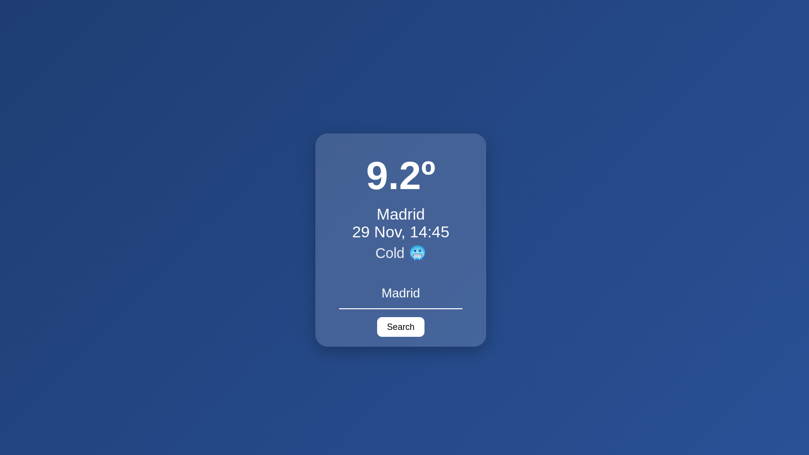

# WeatherApp 🌤️

A simple weather application that shows the current temperature, location, time, and weather condition with dynamic backgrounds and icons based on the temperature. Users can search for any city to get its weather data.

## Features

- Displays **current temperature**, location, date, and weather condition.  
- Dynamic **backgrounds** change according to temperature: Freezing, Cold, Chilly, Warm, Hot, Scorching.  
- Weather **icons** reflect the current temperature.  
- Search for any city using the **search bar**.  
- Smooth **animations** for updating weather information.

## Technologies Used

- **HTML**  
- **CSS** (Glassmorphism style and dynamic backgrounds)  
- **JavaScript** (ES6 modules, fetch API)  
- **Open-Meteo API** for weather data  
- **Open-Meteo Geocoding API** for city search

## How to Run

1. Clone the repository:  
2. Open `index.html` in your browser.  
3. Type a city name in the search bar and press **Search**.

## Project Structure

\```
WeatherApp/
│
├── index.html          # Main HTML file
├── styles.css          # Styling
├── js/
│   └── main.js         # JavaScript logic
└── README.md           # Project documentation
\```

## Notes

- Default search is set to **Madrid**.  
- If the city is not found, it displays a **Not Found** message.  
- Handles errors gracefully with a fallback message."